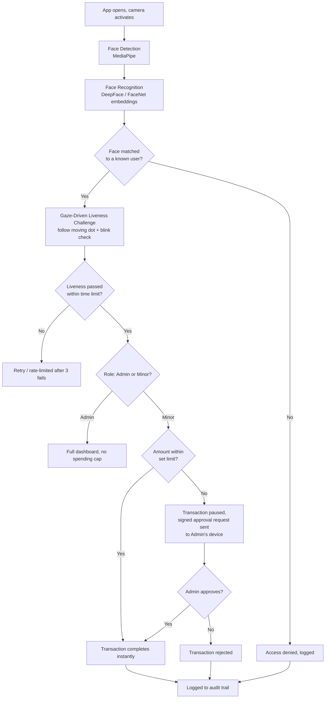

# Guardian-ID

**A Multi-User Biometric UPI Framework using Gaze-Driven Liveness and Role-Based Access Control (RBAC) for minor and shared accounts**

Final Year Major Project — B.Tech Computer Science & Engineering (Cybersecurity)
Pranveer Singh Institute of Technology, Kanpur | AKTU | Session 2026–27
Project ID: `27_CS_CYS_4A_01`

---

## The problem

UPI apps are built on a "one device, one user" assumption. Real households aren't like that — phones get shared, kids use a parent's device or their own linked device, and there's currently no way for the app itself to know *who* is holding it before money moves.

This creates two concrete risks:
- **Unauthorized spending** — a minor can knowingly or accidentally complete a high-value transaction with no supervisor consent step in the way.
- **Identity spoofing** — static face-unlock is vulnerable to replay attacks: a photo or video of the account owner's face can fool a camera that only checks "does this look like the right face," with no check for whether a live person is actually present.

## The idea

Guardian-ID identifies **who** is using the app in real time, confirms they're a **live, physically present human** (not a photo, video, or spoofed feed), and then enforces spending rules based on their role — before a transaction is allowed to complete.

```
Face recognized  →  Liveness confirmed  →  Role identified  →  Rules enforced
   (who)              (really them,          (Admin / Minor)     (spend freely /
                        right now)                                capped + approval)
```

- **Admin (parent)** — full simulated wallet, sets spending limits for linked Minor accounts, approves or rejects flagged transactions from their own device.
- **Minor (child)** — a separate, capped pocket wallet. Spending within the set limit goes through instantly; anything above it pauses and sends a real-time approval request to the Admin's phone.

> **Note on scope:** this project does **not** integrate with real UPI/NPCI rails — that requires bank/PSP partnership and regulatory approval no student project can obtain. Guardian-ID is a **simulated UPI-inspired secure payment prototype**, demonstrating the identity, liveness, and access-control framework that such a system would need. This is a deliberate scoping decision, not a limitation of the build.

---

## How it works



### The liveness check, specifically

A dot moves to a random position on screen. MediaPipe Face Mesh tracks iris position relative to the eye corners every frame, producing a gaze-direction ratio. The system checks that this ratio moved toward the dot's direction within a short reaction window, **and** that a blink occurred somewhere in that window — a static photo can't do either on cue, and a video replay struggles to do both convincingly in real time.

### The RBAC layer

Deliberately rule-based, not ML — this is an explainable access-control decision, not a prediction:

```
IF role == ADMIN:            allow any amount
IF role == MINOR:
    IF amount <= limit:       allow instantly
    IF amount >  limit:       pause + notify Admin for approval
```

---

## Tech stack

| Layer | Technology |
|---|---|
| Mobile app | Flutter + Dart, Provider/Riverpod, camera plugin |
| Backend API | Python 3.10, FastAPI, OAuth2 + JWT |
| Real-time approval | WebSockets / Supabase Realtime / Firebase Cloud Messaging |
| Database | Supabase (PostgreSQL) |
| Face detection | MediaPipe Face Detection |
| Face recognition | DeepFace (FaceNet512 embeddings), cosine similarity matching |
| Liveness detection | MediaPipe Face Mesh (iris landmarks), custom gaze-ratio + blink logic |
| Anti-spoofing (optional layer) | Pretrained presentation-attack-detection model |
| Security | bcrypt (PIN hashing), AES-256-GCM (encryption at rest), JWT (session + liveness tokens), HMAC-SHA256 (signed approval payloads) |

---

## Repository structure

```
guardian-id/
├── backend/            FastAPI app, routes, DB connection, models
│   ├── main.py
│   ├── database.py
│   ├── models.py
│   └── routes/
│       ├── identify.py
│       ├── liveness.py
│       ├── transaction.py
│       └── auth.py
├── ai/                 Face detection, recognition, gaze liveness
│   ├── face_detect.py
│   ├── face_recognize.py
│   ├── gaze_tracker.py
│   └── test_camera.py
├── security/            Hashing, encryption, JWT, HMAC
│   ├── hashing.py
│   ├── encryption.py
│   ├── jwt_handler.py
│   └── signature.py
├── mobile/              Flutter app
│   └── guardian_app/
└── docs/                 Schema, test cases, threat model
```

---

## Security design

- **Biometric data minimization** — only 512-dimensional face embeddings are stored, never raw images.
- **Password/PIN storage** — bcrypt, salted, work factor 12.
- **Data at rest** — AES-256-GCM (authenticated encryption) for sensitive fields.
- **API auth** — short-lived JWT access tokens; a separate, very short-lived liveness token is minted only after a passed gaze challenge and required by the transaction endpoint.
- **Approval integrity** — HMAC-SHA256 signed payloads for approval requests pushed to the Admin's device, preventing tampering in transit.
- **Rate limiting** — account lock after 3 consecutive failed liveness attempts.
- **Audit trail** — append-only log of every identify/liveness/transaction/approval event.

---

## Team

| Name | Roll No | Role |
|---|---|---|
| Suhani Sharma | 2301641720129 | AI/ML,Database |
| Yogita Chauhan | 2301641720146 |  Backend |
| Poonam Singh | 2301641720077 | Mobile app (Flutter) |
| Vedansh Gupta | 2301641720140 | Testing, Automation |


Supervisor: Assistant Professor Varundeep Singh

---

## References

1. [MediaPipe — Cross-platform ML solutions](https://mediapipe.dev)
2. [FastAPI Documentation](https://fastapi.tiangolo.com)
3. [DeepFace (GitHub)](https://github.com/serengil/deepface)
4. NIST, *Digital Identity Guidelines*, 2022
5. OWASP, *Authentication and Authorization Guidelines*, 2023

---

## Status

🚧 Active development — final year project, session 2026–27.
